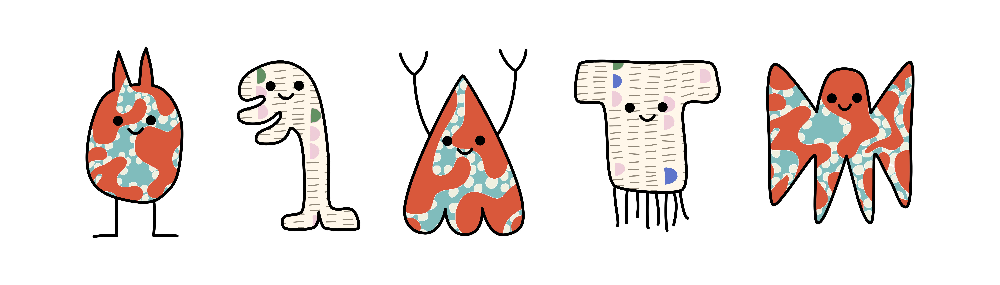

Modeling second language acquisition for language aptitude assessment
==============

***Krisztina Sára Lukics, Anna Bródy, Ágnes Lukács***

# Videos of tasks
[1. Word Learning Task](https://youtu.be/MWH_xNrTYn0){:target="_blank"}  
[2. Passive Learning Task](https://youtu.be/3t8sZHLo24k){:target="_blank"}  
[3. Sentence Comprehension Task](https://youtu.be/6NcVqzFEoFM){:target="_blank"}  
[4. Sentence Production Task](https://youtu.be/I6bXLBpQy-M){:target="_blank"}  
[5. Chunk Sensitivity Task](https://youtu.be/fZrH8c-Aw6w){:target="_blank"}  
[6. Grammatical Sensitivity Task](https://youtu.be/kXWePG6RG64){:target="_blank"}  

# Task demo
Try the short version of the task [here](https://run.pavlovia.org/lendulet_nyelvelsajatitas/BrocantoHPilot1Session1){:target="_blank"}!

# Contact
If you would like to contact us, write us here: [lukics.krisztina.sara@ttk.bme.hu](mailto:lukics.krisztina.sara@ttk.bme.hu)

# Download the poster
You can download the poster from [here](https://drive.google.com/file/d/1UwmUeHaxmSnHAi7EbqK_nDdyqoyjD3DH/view?usp=sharing){:target="_blank"}.

  

